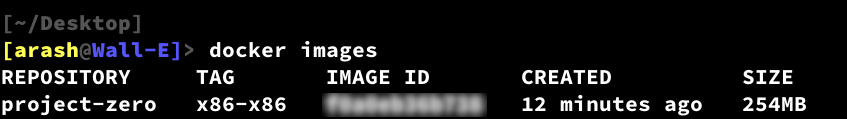

[Back](../README.md)

# Chapter 0: Development Enviroment 
To have a controlled development environment and consequently have less chance of system-dependent errors, we will build an [OCI](https://github.com/opencontainers/image-spec/blob/main/spec.md) container image. The next step would be to run a container and map our development directory into the container's filesystem. You can pull the image from [docker.io](https://hub.docker.com/r/prealm/project-zero/tags) or build it from scratch using [alpine](https://www.alpinelinux.org/) [3.16.2 image](https://hub.docker.com/layers/library/alpine/3.16.2/images/sha256-1304f174557314a7ed9eddb4eab12fed12cb0cd9809e4c28f29af86979a3c870?context=explore). The choice is yours.

I use [Podman](https://podman.io/) (It's better suited for the steam deck, which is my daily driver ;) for the building and management of containers. Because Podman's interface is the same as Docker's, the commands will be the same for both. But the way they handle permission of mapped directories might be different. 

So we need Podman or Docker installed before proceeding. If you are using podman, replace "docker" with "podman" in the commands or add ```alias docker='podman'``` to your **.bashrc** and continue using the docker instead of podman.

We will build an x86 OS, and to keep everything simple, we will use an x86 version of alpine. Therefore, upon pulling the alpine image, you might encounter a warning. I will add spin-off projects for other ISAs in the future, and they will have their own OCI images. The tag of the images determines the host and target ISA. For example, x86-x86 is an x86 system that targets building an x86 OS. But amd64-arm is an amd64 host for cross-compilation of an arm OS.

### The easy way:
To pull the image from docker.io:
```
docker pull prealm/project-zero:x86-x86
```
### The fun way:
All we need to build the image is a [Dockerfile](https://docs.docker.com/engine/reference/builder/). Our **Dockerfile** consists of three simple commands that are explained below:
1. To use [i386/alpine:3.16.2](https://hub.docker.com/r/i386/alpine/) as the base (The next steps will add up to what has already provided in this image) 
```
FROM i386/alpine:3.16.2
```

2. To update apk pacakge manager

```
RUN apk update
```

3. To install a collection of the [necessary packages](./Packages.md)
    * [bash](./Packages.md#bash)
    * [bc](./Packages.md#bc)
    * [bison](./Packages.md#bison)
    * [build-base](./Packages.md#build-base)
    * [cpio](./Packages.md#cpio)
    * [flex](./Packages.md#flex)
    * [libelf](./Packages.md#libelf)
    * [libelf-static](./Packages.md#libelf-static)
    * [elfutils-dev](./Packages.md#elfutils-dev)
    * [ncurses-dev](./Packages.md#ncurses-dev)
    * [ncurses-static](./Packages.md#ncurses-static)
    * [openssl-dev](./Packages.md#openssl-dev)
    * [openssl-libs-static](./Packages.md#openssl-libs-static)
    * [linux-headers](./Packages.md#linux-headers)
    * [xz](./Packages.md#xz)
    * [vim](./Packages.md#vim)

```
RUN apk add \
        bash \
        bc \
        bison \
        build-base \
        cpio \
        flex \
        libelf \
        libelf-static \
        elfutils-dev \
        ncurses-dev \
        ncurses-static \
        openssl-dev \
        openssl-libs-static \
        linux-headers \
        xz \
        vim
```
---

Now lets create the the image by following below steps and execute the commands consecutively.

1. Create a directory. I will call it "x86-x86".
```
mkdir x86-x86 && cd x86-x86
```
2. Create the docker file.
```
echo "FROM i386/alpine:3.16.2

RUN apk update
RUN apk add \
        bash \
        bc \
        bison \
        build-base \
        cpio \
        flex \
        libelf \
        libelf-static \
        elfutils-dev \
        ncurses-dev \
        ncurses-static \
        openssl-dev \
        openssl-libs-static \
        linux-headers \
        xz \
        vim" > Dockerfile
```
3. Build the image
```
docker build . -t project-zero:x86-x86
```

4. Cleaning: (Optional)
```
rm Dockerfile && cd .. && rmdir x86-x86
```
---
Now lets check the result, to list images run the command:
```
docker images
```
And the result should contain a row like this:
</br>
