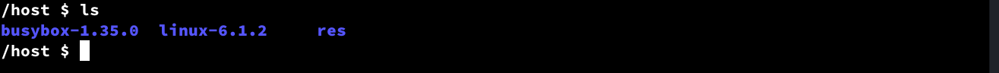

[Back](../README.md)

# Chapter 1: Linux + "sh" shell

I assume we have our OCI image ready and can use docker or podman to run a container to start building the system.

In this chapter we disable all Linux kernel features and then enable only the bare minimum needed to run a **sh** shell after boot. We heavily rely on [Busybox](https://busybox.net/) in this project this project. So, to save time, instead of statically building another shell and use it as **init** process, we use builtin **sh** shell inside Busybox.

[Busybox](https://busybox.net/) is a software suite that provides several Unix utilities in a single executable file. It is often used in embedded devices because it is small, efficient, and provides a simple interface for users to access the utilities. Some of the utilities that BusyBox provides include ls, cat, echo, grep, and sed, among others. BusyBox can be configured to include or exclude certain utilities, depending on the needs of the device it is being used on.

After running our development container, we build the minimal kernel and Busybox executable. Then, we will create an **initrd** image using **cpio**. At the end, using qemu, we will mix everything together to run the compiled Linux kernel with the Busybox binary as the **userspace** software in an virtualized environment.

## Step 1: Running the container

First, create a directory named **"host"**. We map this directory into the container filesystem to act as shared storage between the host and the container.

```
mkdir host && cd host
```

If you followed the previous instructions in [Chapter 0](../Chapter-0/Chapter-0.md), you have a OCI image called **"project-zero"** with **"x86-x86"** tag. Below command will run the container.

```
docker run --user $(id -u):$(id -g) --platform=i386 --rm -it -v $(pwd):/host project-zero:x86-x86
```
Lets break down the meaning of each options:
* **--user**: Instructs docker to use specific user and group ids instead of root. This makes life easier later when we want to access the files created in the container from the host. The command **"id"** is used to extract current user/group ids, so it should be availabe on the host.
* **--platform:** Most probably, you are using a CPU with [AMD64](https://en.wikipedia.org/wiki/X86-64) [ISA](https://en.wikipedia.org/wiki/Instruction_set_architecture), bust we are building a [i386](https://en.wikipedia.org/wiki/I386) operating system in an i386 container. AMD64 processesor are backward compatible and can support i386 code provided that the OS and the rest of software stack supports it. Here we are telling docker that we know what we are doing, so it stops sending us warnings about ISA mismatch. 
* **--rm:** Instructs docker to remove the container after exit
* **--it:** Instructs docker that we need an interactive shell connected to a terminal
* **-v:** Instrcuts docker to map a path on the host specified before ":" into a path(inside the container) that comes after it. So here, we are mapping the **"host"** directory that we created into a the path **"/host/"** in the container.

After running the command, you should have something similar to the below image:


## Step 2: Downloading the kernel and busybox source codes
 
Linux kernel's and Busybox's configurations remain consistent most of the time. But, new features are introduced in new releases and sometimes lead to a minor rearrangement of configurations. Therefore, I suggest using the same version mentioned next in your first build. We will [Linux 6.1.2](https://mirrors.edge.kernel.org/pub/linux/kernel/v6.x/linux-6.1.2.tar.xz) and [Busybox 1.35.0](https://www.busybox.net/downloads/busybox-1.35.0.tar.bz2).

First, we create a directory **"res"** to download the source code tar files.
```
mkdir res && cd res
```

Then download the Linux source tar file with command:
```
wget https://mirrors.edge.kernel.org/pub/linux/kernel/v6.x/linux-6.1.2.tar.xz
```

And do the same for Busybox:
```
wget https://www.busybox.net/downloads/busybox-1.35.0.tar.bz2
```

Now we use **"tar"** command to extract the content of the tar file and have access to the acutal source codes.

We want to extract the source code in the parent directory, so:
```
cd ..
```

Then for Linux kernel:
```
tar xvf res/linux-6.1.2.tar.xz
```

And for Busybox:
```
tar xvf res/busybox-1.35.0.tar.bz2
```

Regarding the tar command:
* The **"x"** option stands for "extract", and tells tar to extract the contents of an archive. 
* The **"v"** option stands for "verbose", and tells tar to print the names of the files it is extracting to the terminal as it is extracting them.
* The **"f"** option stands for "file", and specifies the name of the archive file that tar should operate on.

At the end, the host directory content should be like this:



## Step 3: Configuring and bulding the Linux kernel

## Step 3: Configuring and bulding busybox

## Step 4: Create a initrd image

## Step 5: Run our minimal system using qemu