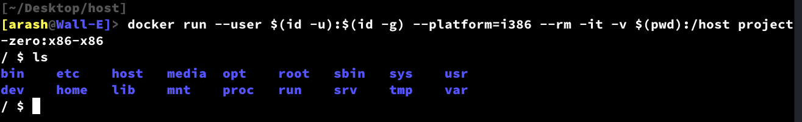

[Back](../README.md)

# Chapter 1: Linux + sh

I assume we have our OCI image ready and can use docker or podman to run a container to start building the system.

## Step 1: Running the container

First, create a directory named **"host"**. We map this directory into the container filesystem to act as shared storage between the host and the container.

```
mkdir host && cd host
```

If you followed the previous instructions in Chapter 0, you have a OCI image called **"project-zero"** with **"x86-x86"** tag. Below command will run the container.

```
docker run --user $(id -u):$(id -g) --platform=i386 --rm -it -v $(pwd):/host project-zero:x86-x86
```
Lets break down the meaning of each options:
* **--user**: Instructs docker to use specific user and group ids instead of root. This makes life easier later when we want to access the files created in the container from the host. The command **"id"** is used to extract current user/group ids, so it should be availabe on the host.
* **--platform:** Most probably, you are using a CPU with [AMD64](https://en.wikipedia.org/wiki/X86-64) [ISA](https://en.wikipedia.org/wiki/Instruction_set_architecture), bust we are building a [i386](https://en.wikipedia.org/wiki/I386) operating system in an i386 container. AMD64 processesor are backward compatible and can support i386 code provided that the OS and the rest of software stack supports it. Here we are telling docker that we know what we are doing, so it stops sending us warnings about ISA mismatch. 
* **--rm:** Instructs docker to remove the container after exit
* **--it:** Instructs docker that we need an interactive shell connected to a terminal
* **-v:** Instrcuts docker to map a path on the host specified before ":" into a path(inside the container) that comes after it. So here, we are mapping the **"host"** directory that we created into a the path **"/host/"** in the container.

After running the command, you should have something similar to the below image:



## Step 2: Downloading the kernel and busybox source codes

## Step 3: Configuring and bulding the Linux kernel

## Step 3: Configuring and bulding busybox

## Step 4: Create a initrd image

## Step 5: Run our minimal system using qemu